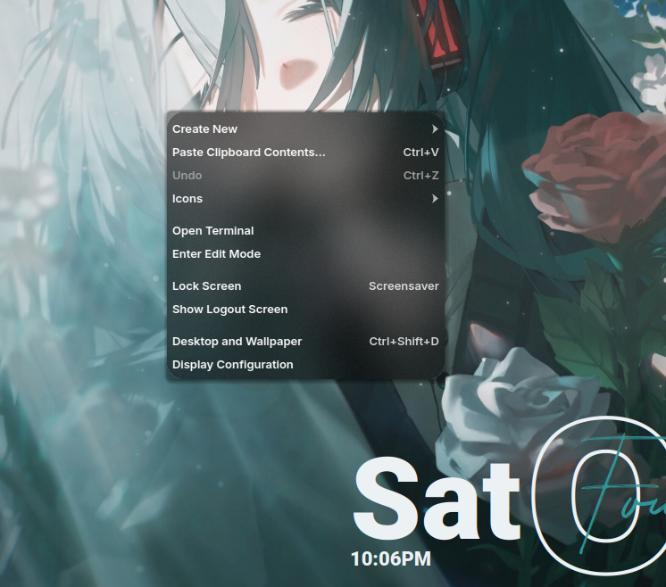
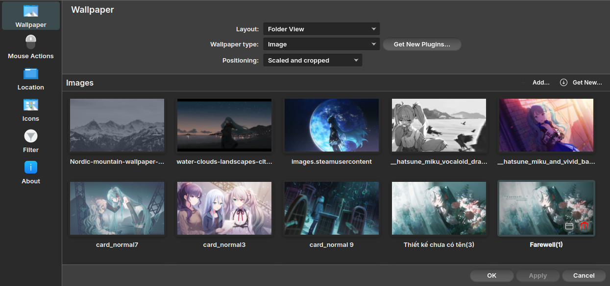
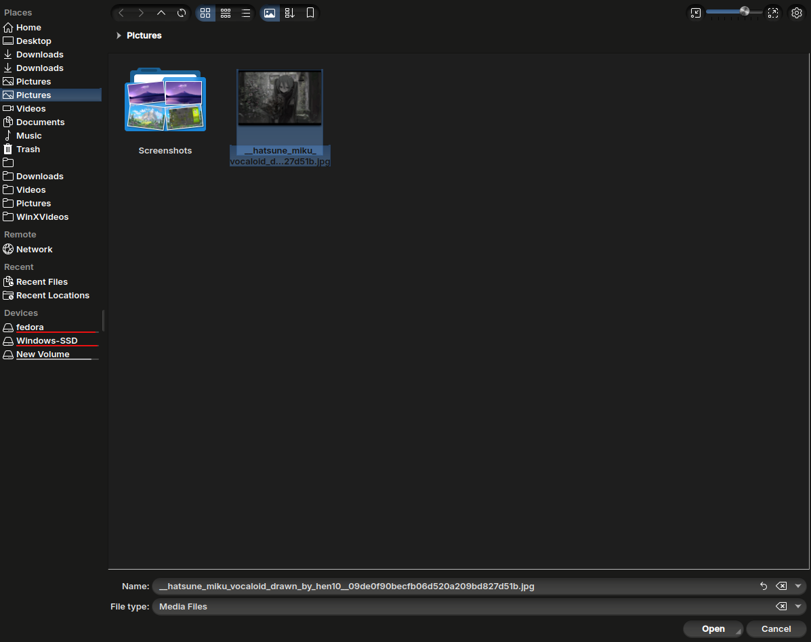
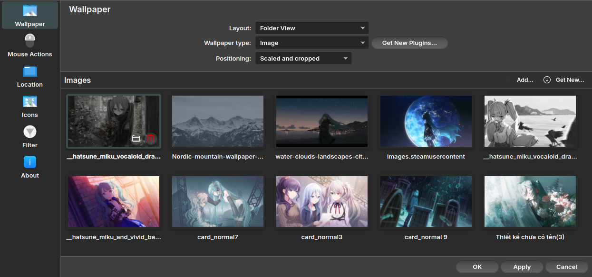

# 🖼️ A GOOD BACKGROUND IMAGE CARRIES THE WHOLE DESKTOP.

*There's no good rice that doesn't have a good background image.*

*The first thing you stare at after you start your computer session is the background image.*

*The first thing you have to care about when ricing is the background.*

The background is the bare bones of desktop customization. So, let me introduce you to some of my favourites.

## 1. Miku and funeral (1/2 Body)

.png)

> *Originally drawn by [Konya Karasue](https://www.pixiv.net/en/users/10109777), recoloured and added texts by ShotChannel (me).*

## 2. Miku and funeral (Face-focused, Flowers-focused)

.png)

> *Originally drawn by [Konya Karasue](https://www.pixiv.net/en/users/10109777), recoloured by ShotChannel (me).*

## 3. Miku and funeral (Full Body)

.png)

> *Originally drawn by [Konya Karasue](https://www.pixiv.net/en/users/10109777), recoloured by ShotChannel (me).*

> [!NOTE]
> The list is still expanding...Until the end of time...🕙

# How to change backgrounds in KDE Plasma?

*I believe people already knew this one, but just in case...*

## Step I: Open the ***Desktop and Wallpaper*** setting by right-clicking the desktop.

## Step II: Click ***+ Add***.

## Step III: Find where your image is located, choose it and click ***Open***.

## Step IV: Choose the image in the setting then click ***Apply***.

And it's done! Congrats!
